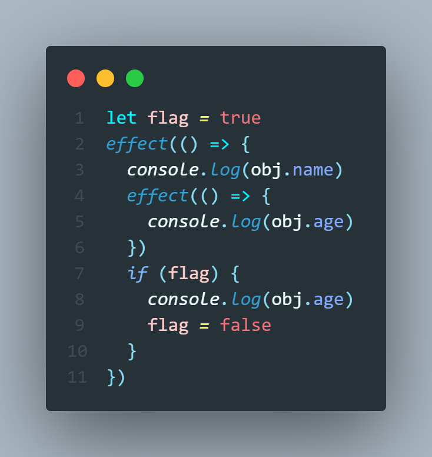
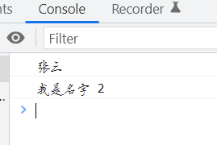

# mini-vue3

## Vue设计思想

- Vue3.0更注重模块上的拆分，在2.0中无法单独使用部分模块。需要引入完整的Vuejs(例如只想使用使用响应式部分，但是需要引入完整的Vuejs)， Vue3中的模块之间耦合度低，模块可以独立使用。 **拆分模块**
- Vue2中很多方法挂载到了实例中导致没有使用也会被打包（还有很多组件也是一样）。通过构建工具Tree-shaking机制实现按需引入，减少用户打包后体积。 **重写API**
- Vue3允许自定义渲染器，扩展能力强。不会发生以前的事情，改写Vue源码改造渲染方式。 **扩展更方便**

> 依然保留Vue2的特色

### 声明式框架

> Vue3依旧是声明式的框架，用起来简单。

**命令式和声明式区别**

- 早在JQ的时代编写的代码都是命令式的，命令式框架重要特点就是关注过程
- 声明式框架更加关注结果。命令式的代码封装到了Vuejs中，过程靠vuejs来实现

> 声明式代码更加简单，不需要关注实现，按照要求填代码就可以 （给上原材料就出结果）

```js
- 命令式编程：
let numbers = [1,2,3,4,5]
let total = 0
for(let i = 0; i < numbers.length; i++) {
  total += numbers[i] - 关注了过程
}
console.log(total)

- 声明式编程：
let total2 = numbers.reduce(function (memo,current) {
  return memo + current
},0)
console.log(total2)
```

### 采用虚拟DOM

传统更新页面，拼接一个完整的字符串innerHTML全部重新渲染，添加虚拟DOM后，可以比较新旧虚拟节点，找到变化在进行更新。虚拟DOM就是一个对象，用来描述真实DOM的

```js
const vnode = {
    __v_isVNode: true,
    __v_skip: true,
    type,
    props,
    key: props && normalizeKey(props),
    ref: props && normalizeRef(props),
    children,
    component: null,
    el: null,
    patchFlag,
    dynamicProps,
    dynamicChildren: null,
    appContext: null
} 
```

### 区分编译时和运行时

- 我们需要有一个虚拟DOM，调用渲染方法将虚拟DOM渲染成真实DOM （缺点就是虚拟DOM编写麻烦）
- 专门写个编译时可以将模板编译成虚拟DOM （在构建的时候进行编译性能更高，不需要再运行的时候进行编译，而且vue3在编译中做了很多优化）

## Vue3 架构

### Monorepo 管理项目

Monorepo 是管理项目代码的一个方式，指在一个项目仓库(repo)中管理多个模块/包(package)。 Vue3源码采用 monorepo 方式进行管理，将模块拆分到package目录中。

- 一个仓库可维护多个模块，不用到处找仓库
- 方便版本管理和依赖管理，模块之间的引用，调用都非常方便

### Vue3采用Typescript

> Vue2 采用Flow来进行类型检测 （Vue2中对TS支持并不友好）， Vue3源码采用Typescript来进行重写 , 对Ts的支持更加友好。

## vue的开发环境搭建

### 搭建Monorepo环境

Vue3中使用`pnpm` `workspace`来实现`monorepo` ([pnpm](https://pnpm.io/)是快速、节省磁盘空间的包管理器。主要采用符号链接的方式管理模块)

#### 全局安装pnpm

```shell
npm i pnpm -g
```

#### 创建.npmrc文件

```js
shamefully-hoist = true
```

这里您可以尝试一下安装`Vue3`, `pnpm install vue@next`此时默认情况下`vue3`中依赖的模块不会被提升到`node_modules`下。 添加**羞耻的提升**可以将Vue3，所依赖的模块提升到`node_modules`中。

**可以这样理解，我们加入安装了koa框架，而koa框架如果用到了connect模块，安装的时候肯定是会一起下载下来的，如是用npm安装，我们就可以直接使用connect模块的东西，但是如果哪天koa框架升级不再依赖该模块，就会导致我们用不成connect模块了，也就是突然消失了。**

### 配置workspace

新建 **pnpm-workspace.yaml**

```yaml
packages:
  - 'packages/*'
```

> 将packages下所有的目录都作为包进行管理。这样我们的Monorepo就搭建好了。确实比`lerna + yarn workspace`更快捷

**此时，如果我们在项目根目录下，安装vue**

```shell
pnpm install vue
```

会报错


因为我们安装这个包是作为全局共享包，还是每个包的子包，并没有说清楚：

因此：我们需要加上`-w`

表示作为全局共享包。`-w`也就是 `--workspace-root`

```shell
pnpm i vue -w
```

## 环境搭建

**打包项目Vue3采用rollup进行打包代码，安装打包所需要的依赖**

**也可以先安装需要的模块：**

```shell
pnpm install typescript minimist esbuild  -w -D
```

其他模块可以在后面再安装。

| 依赖                        |                           |
| --------------------------- | ------------------------- |
| typescript                  | 在项目中支持Typescript    |
| rollup                      | 打包工具                  |
| rollup-plugin-typescript2   | rollup 和 ts的 桥梁       |
| @rollup/plugin-json         | 支持引入json              |
| @rollup/plugin-node-resolve | 解析node第三方模块        |
| @rollup/plugin-commonjs     | 将CommonJS转化为ES6Module |
| minimist                    | 命令行参数解析            |
| execa@4                     | 开启子进程                |

```shell
pnpm install typescript rollup rollup-plugin-typescript2 @rollup/plugin-json @rollup/plugin-node-resolve @rollup/plugin-commonjs minimist execa@4 esbuild   -D -w
```

#### 初始化TS

```shell
pnpm tsc --init
```

先添加些常用的`ts-config`配置，后续需要其他的在继续增加

```json
{
  "compilerOptions": {
    "outDir": "dist", // 输出的目录
    "sourceMap": true, // 采用sourcemap
    "target": "es2016", // 目标语法
    "module": "esnext", // 模块格式
    "moduleResolution": "node", // 模块解析方式
    "strict": false, // 严格模式
    "resolveJsonModule": true, // 解析json模块
    "esModuleInterop": true, // 允许通过es6语法引入commonjs模块
    "jsx": "preserve", // jsx 不转义
    "lib": ["esnext", "dom"], // 支持的类库 esnext及dom
     "baseUrl":"./",
      "paths":{
          "@vue/*":["packages/*"]
      }
  }
}
```

### 创建模块

> 我们现在`packages`目录下新建两个package，用于下一章手写响应式原理做准备

- reactivity 响应式模块
- shared 共享模块

**所有包的入口均为`src/index.ts` 这样可以实现统一打包**

- reactivity/package.json

```json
{
  "name": "@vue/reactivity",
  "version": "1.0.0",
  "main": "index.js",
  "module":"dist/reactivity.esm-bundler.js",
  "unpkg": "dist/reactivity.global.js",
  "buildOptions": {
    "name": "VueReactivity",
    "formats": [
      "esm-bundler",
      "cjs",
      "global"
    ]
  }
}
```

- shared/package.json

```json
{
    "name": "@vue/shared",
    "version": "1.0.0",
    "main": "index.js",
    "module": "dist/shared.esm-bundler.js",
    "buildOptions": {
        "formats": [
            "esm-bundler",
            "cjs"
        ]
    }
}
```

**formats**为自定义的打包格式，有`esm-bundler`在构建工具中使用的格式、`esm-browser`在浏览器中使用的格式、`cjs`在node中使用的格式、`global`立即执行函数的格式

```shell
pnpm install @vue/shared@workspace --filter @vue/reactivity
```

**配置`ts`引用关系**

```json
"baseUrl": ".",
"paths": {
    "@vue/*": ["packages/*/src"]
}
```

### 开发环境`esbuild`打包

创建开发时执行脚本， 参数为要打包的模块

**解析用户参数**

```json
"scripts": {
    "dev": "node scripts/dev.js reactivity -f global"
}
```

```js
const { build } = require('esbuild')
const { resolve } = require('path')
const args = require('minimist')(process.argv.slice(2));

const target = args._[0] || 'reactivity';
const format = args.f || 'global';

const pkg = require(resolve(__dirname, `../packages/${target}/package.json`));

const outputFormat = format.startsWith('global')// 输出的格式
    ? 'iife'
    : format === 'cjs'
        ? 'cjs'
        : 'esm'

const outfile = resolve( // 输出的文件
    __dirname,
    `../packages/${target}/dist/${target}.${format}.js`
)

build({
    entryPoints: [resolve(__dirname, `../packages/${target}/src/index.ts`)],
    outfile,
    bundle: true,
    sourcemap: true,
    format: outputFormat,
    globalName: pkg.buildOptions?.name,
    platform: format === 'cjs' ? 'node' : 'browser',
    watch: { // 监控文件变化
        onRebuild(error) {
            if (!error) console.log(`rebuilt~~~~`)
        }
    }
}).then(() => {
    console.log('watching~~~')
})
```

### 生产环境`rollup`打包

#### rollup.config.js

```js
import path from 'path';
// 获取packages目录
const packagesDir = path.resolve(__dirname, 'packages');
// 获取对应的模块
const packageDir = path.resolve(packagesDir, process.env.TARGET);
// 全部以打包目录来解析文件
const resolve = p => path.resolve(packageDir, p);
const pkg = require(resolve('package.json'));
const name = path.basename(packageDir); // 获取包的名字

// 配置打包信息
const outputConfigs = {
    'esm-bundler': {
        file: resolve(`dist/${name}.esm-bundler.js`),
        format: 'es'
    },
    cjs: {
        file: resolve(`dist/${name}.cjs.js`),
        format: 'cjs'
    },
    global: {
        file: resolve(`dist/${name}.global.js`),
        format: 'iife'
    }
}
// 获取formats
const packageFormats = process.env.FORMATS &&  process.env.FORMATS.split(',');
const packageConfigs =  packageFormats || pkg.buildOptions.formats;

import json from '@rollup/plugin-json'
import commonjs from '@rollup/plugin-commonjs';
import {nodeResolve} from '@rollup/plugin-node-resolve'
import tsPlugin from 'rollup-plugin-typescript2'

function createConfig(format,output){
    output.sourcemap = process.env.SOURCE_MAP;
    output.exports = 'named'; 
    let external = []
    if(format === 'global'){ 
        output.name = pkg.buildOptions.name
    }else{ // cjs/esm 不需要打包依赖文件
        external = [...Object.keys(pkg.dependencies || {})]
    }
    return {
        input:resolve('src/index.ts'),
        output,
        external,
        plugins:[
            json(),
            tsPlugin(),
            commonjs(),
            nodeResolve()
        ]
    }
}
// 开始打包把
export default packageConfigs.map(format=> createConfig(format,outputConfigs[format]));
```

#### [#](http://zhufengpeixun.com/jg-vue/guide/02.start.html#build-js)build.js

```js
const fs = require('fs');
const execa = require('execa')
const targets = fs.readdirSync('packages').filter(f => {
    if (!fs.statSync(`packages/${f}`).isDirectory()) {
        return false;
    }
    return true;
});
async function runParallel(source, iteratorFn) {
    const ret = [];
    for (const item of source) {
        const p = Promise.resolve().then(() => iteratorFn(item))
        ret.push(p);
    }
    return Promise.all(ret)
}
async function build(target) {
    await execa(
        'rollup',
        [
            '-c',
            '--environment',
            `TARGET:${target}`
        ],
        { stdio: 'inherit' }
    )
}
runParallel(targets, build)
```

## 简易版的reactive的实现

- 实现对对象的代理
- 一个对象只会代理一次，多次代理返回的是同一个对象
- 对已经是代理对象的对象进行代理，返回值还是代理对象本身
- 利用的就是代理对象在取值时会触发get钩子，我们只需要在代理对象触发get钩子的时候，直接返回代理对象即可。
- 此时还没有实现对象属性的二次代理，如果属性值是对象，不会创建代理对象

```ts
import { isObject } from "@vue/shared";

/*
 * @Author: 毛毛
 * @Date: 2022-06-25 13:50:54
 * @Last Modified by: 毛毛
 * @Last Modified time: 2022-06-25 14:15:28
 */
// 缓存已经代理过后的响应式对象
const reactiveMap = new WeakMap();

const enum ReactiveFlags {
  IS_REACTIVE = "__v_isReactive",
}
/**
 * 代理对象为响应式
 * @param obj
 */
export function reactive(target: unknown) {
  if (!isObject(target)) return;
  const existingProxy = reactiveMap.get(target);
  // 目标对象被代理过 返回同一个代理
  if (existingProxy) return existingProxy;
  // 第一个普通对象 创建代理
  // 如果传入的对象 是已经被代理过的对象 我们可以看看这个对象是否有get方法，有表示已经是代理对象
  if (target[ReactiveFlags.IS_REACTIVE]) {
    // TODO 取到true 就返回自身 源码这一步很妙
    return target;
  }
  // 创建代理对象
  const proxy = new Proxy(target, {
    get(target, key, receiver) {
      // 用来判断是否是响应式对象
      // 对象没有被代理之前，没有该key，如果代理对象被用来二次代理，会在上面取值，然后get走到这里，返回true了
      if (key === ReactiveFlags.IS_REACTIVE) {
        return true;
      }
      return Reflect.get(target, key, receiver);
    },
    set(target, key, value, receiver) {
      const flag = Reflect.set(target, key, value, receiver);
      return flag;
    },
  });
  // 已经代理的对象进行缓存 如果再次代理同一个对象 返回同一个代理
  reactiveMap.set(target, proxy);
  return proxy;
}
```

当然这样写会有点乱，我们可以把对目标对象的代理操作提取出来：

**baseHandler.ts**:

```ts
/*
 * @Author: 毛毛
 * @Date: 2022-06-25 14:22:33
 * @Last Modified by: 毛毛
 * @Last Modified time: 2022-06-25 14:25:24
 */

export const enum ReactiveFlags {
  IS_REACTIVE = "__v_isReactive",
}
export const mutableHandlers = {
  get(target, key, receiver) {
    // 用来判断是否是响应式对象
    // 对象没有被代理之前，没有该key，如果代理对象被用来二次代理，会在上面取值，然后get走到这里，返回true了
    if (key === ReactiveFlags.IS_REACTIVE) {
      return true;
    }
    return Reflect.get(target, key, receiver);
  },
  set(target, key, value, receiver) {
    const flag = Reflect.set(target, key, value, receiver);
    return flag;
  },
} as ProxyHandler<object>;

```

这样看起来更清晰。

## 实现简易版的effect

该API函数是来收集副作用的。参数是一个函数，当我们函数内使用的变量的值发生改变，会让这个副作用函数重新执行。

这里，我们需要定义一个ReactiveEffect类，也就是响应式的副作用函数，用来记录用户传入的副作用函数，并对其进行一些列扩展，毕竟我们不能随意修改用户传入的函数嘛。

```ts
/*
 * @Author: 毛毛
 * @Date: 2022-06-25 14:00:05
 * @Last Modified by: 毛毛
 * @Last Modified time: 2022-06-25 14:44:53
 */
/**
 * 传入的副作用函数类型
 */
type effectFn = () => any;
export function effect(fn: effectFn) {
  // 创建响应式的effect
  const _effect = new ReactiveEffect(fn);
  // 默认先执行一次副作用函数
  const res = _effect.run();
  return res;
}
/**
 * 当前正在执行副作用函数暴露出去
 */
export let activeEffect: ReactiveEffect = null;
/**
 * 把副作用函数包装为响应式的effect函数
 */
export class ReactiveEffect {
  /**
   * 这个effect默认是激活状态
   *
   * @memberof ReactiveEffect
   */
  active = true;
  constructor(public fn: effectFn) {}
  /**
   *
   * run 方法 就是执行传入的副作用函数
   * @memberof ReactiveEffect
   */
  run() {
    let res;
    // 激活状态 才需要收集这个副作用函数fn内用到的响应式数据 也就是我们说的依赖收集
    // 非激活状态 只执行函数 不收集依赖
    if (!this.active) {
      return this.fn();
    }
    try {
      // 激活状态 依赖收集了 核心就是将当前的effect和稍后渲染的属性关联在一起
      activeEffect = this;
      // 执行传入的fn的时候，如果出现了响应式数据的获取操作，就可以获取到这个全局的activeEffect
      res = this.fn();
    } finally {
      activeEffect = null;
    }
    return res;
  }
  /**
   * 取消副作用函数的激活 不再收集依赖
   */
  stop() {
    this.active = false;
  }
}
```

此时，虽然我们还没开始进行依赖收集，但是如果使用effect函数，是正常执行用户传入的函数逻辑的。


但是，如果我们在effect中再次嵌套effect，此时可以发现，当我们内层的effect结束之后，会回到外层的effect，此时的activeEffect变量的值并不会指回外层的effect对象。

```ts
effect(()=>{
    console.log(obj.name)
    effect(()=>{
        console.log(obj)
    })
    // .... 来到这里 activeEffect 变成 null 了
})
```

所以我们可以修改记录当前正在执行的可响应式副作用对象的变量为一个栈结构。

```ts
let activeEffect:ReactiveEffect[] = []
```

每次执行effect的时候，都关联栈中的最后一个元素，执行完当前的副作用函数就弹出，这样内层effect执行完，栈中的最后一个元素还是指向当前正在执行的effect

**在vue3.0版本的时候，的确就是采用栈结构来实现的。**

但是在最新的3.2版本，又做了一些更改。因为栈结构也是比较消耗性能的。

**最新的策略是采用了类似树结构的形式，每个ReactiveEffect对象，都记录自己父ReactiveEffect对象**，让activeEffect变量依然指向自身，当自己执行完毕以后，将activeEffect的值指向自己的parent属性，也就是父节点，就实现了在嵌套执行effect的时候，不会弄丢activeEffect指向的问题。

可以这样做，主要还是依赖了js是单线程。

```ts
export class ReactiveEffect {
  /**
   * 记录父ReactiveEffect
   *
   * @type {ReactiveEffect}
   * @memberof ReactiveEffect
   */
  parent: ReactiveEffect = null;
 // ...
  run() {
 // ...
    try {
      // 激活状态 依赖收集了 核心就是将当前的effect和稍后渲染的属性关联在一起
      this.parent = activeEffect
      activeEffect = this;
      // 执行传入的fn的时候，如果出现了响应式数据的获取操作，就可以获取到这个全局的activeEffect
      res = this.fn();
    } finally {
      // 执行完当前的effect 归还上次 activeEffect 变量指向的值
      activeEffect = this.parent;
        this.parent = null
    }
    return res;
  }
}
```

### 依赖收集

实现了reactive和effect函数，接下来就是进行依赖收集。

在副作用函数中，我们如果进行了对响应式数据的取值操作，就会触发get，来到get钩子里，就可以进行对当前对象的当前属性收集正在执行的副作用函数。

也就是说：

```js
当前对象 -> 取值get -> key -> effects
```

一个对象有多个属性，每个属性又可能在多个effect中使用，所以一个key对应多个effect，而且应该保证key对应的effect是不重复的（重复的副作用函数有必要吗？很明显没必要）

因此：我们得出可以使用map结构来记录对象和key的关系，用set来记录每个key和effects关系。


我们只需要这样做，就可以完成三者之间的映射关系。

但是，有时候我们在触发副作用函数的执行的时候，可以会出现需要清理副作用函数的情况：

比如：



这种情况再触发副作用函数执行以后，第二次外层副作用函数不会再次取age属性值，也就是说在最新执行完本次的副作用函数以后，我们的age对应的effects集合里面不应该包含外层的effect函数，只应该包含内存的effect

因此：我们可以修改一下ReactEffect，让每个effect响应式副作用的对象也收集一下自己用到的属性：

```ts
deps: Set<ReactiveEffect>[] = [];
```

也就是说，属性知道那些effect用到了自己，而effect对象也知道自己用到了那些属性。也就是多对多的映射。方便我们进行清理操作。


为了便于理解，这里我们最好是把deps改为dep.


至此，我们就完成了依赖收集。下一步就是在响应式数据发生改变的情况下，重新执行副作用函数。

### 触发更新

我们只需要在修改值的时候，也就是触发了代理对象的set操作，在这里进行触发更新，也就是在更新值以后，触发副作用函数的重新执行。

```ts
/**
 * 触发更新
 * @param target
 * @param type 操作类型
 * @param key
 * @param value
 * @param oldValue
 */
export const trigger = (
  target: object,
  type: Operator,
  key: keyof any,
  value: unknown,
  oldValue: unknown
) => {
  const depsMap = targetMap.get(target);
  if (!depsMap) {
    // 在模板中 没有用过这个对象
    return;
  }
  // 拿到属性对应的set effects
  const effects = depsMap.get(key);
  effects && effects.forEach((effect) => effect.run());
};
```

此时我们可以看见，在一秒之后，浏览器再次执行了这个副作用函数：

```js
const { effect, reactive } = VueReactivity
const obj = reactive({
    name: "张三",
    address: [1],
    age: 22
})
let flag = true
effect(() => {
    console.log(obj.name)
    effect(() => {
        console.log(obj.age)
    })
    if (flag) {
        console.log(obj.age)
        flag = false
    }
})
setTimeout(()=>{
    obj.name = '12'
},1000)

```

而且，如果我们给这个对象修改address或者新增属性等，是不会触发副作用函数的执行的。

**但是：如果你在effect函数中修改了当前正在触发设值操作的属性，比如外面修改了age，我在effect函数中又修改了age**，很明显，会触发爆栈操作，无限循环 了


这也是很正常的情况，毕竟我们不可以要求用户不在effect中进行设值操作。

我们知道，通过前面的操作，很明显在执行当前副作用函数的时候，我们会把activeEffect的值设置为当前正在执行的响应式副作用对象。因此，当我们发现正在执行的副作用函数activeEffect的值，和我们下一个将要执行的effect的值是一样的时候，跳过此函数的执行即可。


到现在，我们就实现了一个简易版的依赖收集和触发更新的操作了。当然我们还有很多情况没有考虑，这里只是简单的实现。

到现在实现了一个简单的effect函数。后续的watch，watchEffect等函数都是通过该函数实现的。


### 响应式分支切换原理


一个很简单的分支代码，我们发现在修改flag的值为false以后，此时修改name属性的值，依然会触发effect的更新操作。这是为什么？

讲道理来说，我们这里的flag为false，表示我们在effect执行的时候，是不会收集到对name属性的依赖，所以在后面更新name属性值的时候，不应该再次触发effect的执行，但是结果和我们想的有出入：

我们如何保证在这种分支切换的时候，取消对本次不需要依赖属性的变更？

**这就需要我们在执行effect之前，清空上次已经收集的属性依赖。**

那么我们肯定可以想到如下的操作：在执行effect之前，清空dep set里对当前effect的引用，然后清空当前effect里面收集的所有deps。

```ts
/**
 * 清除effect收集的dep set里 每个属性对当前effect的收集
 * @param effect
 */
const cleanupEffect = (effect: ReactiveEffect) => {
  const { deps } = effect;
  for (let i = 0; i < deps.length; i++) {
    // 解除key -> effect的关联 执行effect的时候重新收集
    deps[i].delete(effect);
  }
  // 清空当前effect依赖的dep
  effect.deps.length = 0;
};

```


看似一切正常，两边的绑定都解除了。但是会发现，控制台疯狂输出打印age的值！！！


有点吓人，按理说没毛病，为什么会出现这种情况？

原因出在执行cleanupEffect函数下面的哪一行代码：也就是执行 `this.fn()`

我们刚把引用清除，这马上就加了进来。

**有点像如下操作：**

```ts
const set = new Set([1,2,3])
set.forEach((val)=>{
    set.delete(1)
    set.add(1)
})
```

知道问题，我们就可以解决了。我们在循环执行副作用函数的时候，也就是触发更新哪里，不要直接操作原依赖set集合，把effects集合拷贝一份，然后循环执行再这个拷贝的数组上进行，不对当前还需要收集依赖的set集合上进行执行操作。


### effect函数返回值

对于effect函数，其实是有返回值的。

我们前面给ReactiveEffect对象都有一个stop方法，用来停止依赖收集。所以我们可以让effect方法返回当前effect.run方法，调用这个返回值可以再次开始收集依赖。


```ts
export function effect(fn: effectFn) {
  // 创建响应式的effect
  const _effect = new ReactiveEffect(fn);
  // 默认先执行一次副作用函数
  _effect.run();
  // effect函数的返回值就是一个runner 可以让失活的effect再次收集依赖
  const runner = _effect.run.bind(_effect); // 绑定this
  runner.effect = _effect; // 将effect挂载到runner上
  return runner;
}
```

这样更改代码以后，我们可以在页面手动让effect失活，但是可以通过effect函数的返回值再次执行run函数。不过只能手动触发执行，该effect不会再次收集依赖了。




**效果上我们依然可以手动触发执行effect，但是这就类似于手动执行函数了。**可以看见后面的更新属性也不会触发effect的执行了。stop函数主要是为了vue3.2新增的`effectScope`方法服务的。


### vue调度器

实现了上述操作，可以发现更新都是同步的，也就是我们同步连续两次修改同一个属性，会触发两次effect的执行。


这个从同步代码来说是没有任何问题的。你修改了两次name属性，必须会触发两次更新。

但是如果我们在一次同步代码的执行过程中，修改了几次name属性，就需要触发几次effect的更新，是不是有点消耗性能？其实我们想要的效果就是最后一次修改值生效，也就是只有同步代码执行完，才去触发依赖effect的执行。那么只需要执行一次effect函数即可。

通过上面的操作，我们对effect函数的执行，要不然通过effect的返回值自己控制执行函数，要不然就是通过依赖收集以后自动触发effect的执行。

有时候我们可能需要自己控制effect的执行，也就是希望把传入的函数的执行权归还给我们。这就是`调度器`的出现由来。

实际上在vue内部，也是通过调度器来实现多次更新批处理（合并，只处理最后一次），以及异步更新等。

在这里只是实现调度器，暂时并没有实现异步更新和批处理等。

**更新一下我们的effect参数**

```ts
interface EffectOptions {
  scheduler?: EffectScheduler;
}
// 调度器
type EffectScheduler = (effect: ReactiveEffect) => any;

/**
 * 创建响应式的effect
 * @param fn 副作用函数
 * @param options 配置对象
 * @returns
 */
export function effect(fn: effectFn, options?: EffectOptions) {
  // 创建响应式的effect
  const _effect = new ReactiveEffect(fn, options?.scheduler);
  // 默认先执行一次副作用函数
  _effect.run();
  // effect函数的返回值就是一个runner 可以让失活的effect再次执行 只是需要手动触发执行了(不会自动开始收集依赖)
  const runner = _effect.run.bind(_effect); // 绑定this
  runner.effect = _effect; // 将effect挂载到runner上
  return runner;
}
```

**然后就是更新一下ReactiveEffect的构造函数**

```ts
constructor(public fn: effectFn, public scheduler?: EffectScheduler) {}
```

**最后就是在触发更新的时候，把我们的直接执行run方法，修改为在用户传递调度器的情况下，执行用户的逻辑**

```ts
  if (effects) {
    // 把依赖effects拷贝一份 我们的执行操作在这个数组上 不直接操作原set集合了
    const fns = [...effects];
    fns.forEach((effect) => {
      if (effect !== activeEffect) {
        if (effect.scheduler) {
          // 用户传入了调度函数，使用用户的
          effect.scheduler(effect);
        } else {
          effect.run();
        }
      }
    });
  }
```

### 实现属性递归代理

在前面的实现代理的地方，也就是get方法哪里，我们并没有处理被代理对象属性仍然是一个对象的情况，对于属性是对象的时候，我们仍然应该再取值的时候，对该属性进行代理。vue3采取的就是再获取值的时候，如果发现是对象，对该属性进行懒代理。

```ts
  get(target, key, receiver) {
    // 用来判断是否是响应式对象
    // 对象没有被代理之前，没有该key，如果代理对象被用来二次代理，会在上面取值，然后get走到这里，返回true了
    if (key === ReactiveFlags.IS_REACTIVE) {
      return true;
    }
    track(target, "get", key);
    // 取值操作
    const value = Reflect.get(target, key, receiver);
    if (isObject(value)) {
      // 属性值是对象 懒代理
      return reactive(value);
    }
    return value;
  }
```


**此时可以看见，打印出来的address对象也是响应式的。**

而且，如果你没有手动获取过属性是对象的值，那么是不会对该属性进行代理的。

很明显：这样的方式会显著的提示性能，对于vue2是一上来就递归代理所有属性。


## 计算属性的实现

计算属性，最大的特点就是缓存。计算属性中所依赖的值不发生改变，我们不会重新计算最新的计算属性的值，而是取缓存中的值。

而且，computed也是基于effect实现的。

计算属性也是懒执行的，也就是说，定义的计算属性，如果没有使用这个计算属性的值，我们是不会真的计算值的。

**所以，我们在实现计算属性的时候，内部应该是有一个标识的，表名当前计算属性的值是否是脏的，如果是脏的，表示依赖的属性发生改变，需要重新计算，那么在下次取值的时候，就会重新计算最新的值。**

所以我们可以认为计算属性就是一个懒执行，有缓存的effect。而且，计算属性因为我们当做属性，所以在取计算属性的值的时候，也会收集所在的effect添加到set上。

```ts
import { ReactiveEffect } from "./effect";
import { isFunction } from "@vue/shared";

/*
 * @Author: 毛毛
 * @Date: 2022-06-26 13:48:11
 * @Last Modified by: 毛毛
 * @Last Modified time: 2022-06-26 14:19:41
 */
type ComputedGetter = () => any;
type ComputedSetter = (newVal) => void;
type ComputedOptions =
  | ComputedGetter
  | {
      get: ComputedGetter;
      set: ComputedSetter;
    };
export const computed = (getterOrOptions: ComputedOptions) => {
  const onlyGetter = isFunction(getterOrOptions);
  let getter;
  let setter;
  if (onlyGetter) {
    getter = getterOrOptions;
    setter = () => {
      console.warn(`不能修改一个只读的计算属性的值！`);
    };
  } else {
    getter = getterOrOptions.get;
    setter = getterOrOptions.set;
  }
  return new ComputedRefImpl(getter, setter);
};

/**
 * 计算属性的实现
 */
class ComputedRefImpl {
  private effect: ReactiveEffect;
  // 默认是脏数据 取值的时候会重新计算
  private _dirty = true;
  // 只读
  private __v_isReadonly = true;
  // ref
  private __v_isRef = true;
  // 缓存的计算属性值
  private _value;
  constructor(public getter: ComputedGetter, public setter: ComputedSetter) {
    /*
      计算属性内部就是通过可响应式的effect实现的，通过调度器来自己执行getter
      执行getter的时候 很显然会收集依赖 在依赖变更的时候 会执行我们的调度函数
    */
    this.effect = new ReactiveEffect(getter, (effect) => {
      // 依赖的属性变化 会执行该调度函数
      if (!this._dirty) {
        this._dirty = true; 
      }
    });
  }
  /**
   * 类的属性访问器 -> 其实就是 definePrototype
   *
   * @memberof ComputedRefImpl
   */
  get value() {
    // 先判断是否是脏值
    if (this._dirty) {
      this._value = this.effect.run();
      // 计算最新值了  不是脏值了
      this._dirty = false;
    }
    return this._value;
  }
  set value(newVal) {
    this.setter(newVal);
  }
}

```

**此时：我们可以看见在effect函数中，取计算属性的值的时候，是可以正常拿到计算属性的值的**

但是在依赖的时候发生更新以后，我们并没有触发effect的重新执行。这是为什么？

我们在调度器中已经修改了计算属性的值是脏值的标记，为什么不会重新执行effect？

```js
    const { effect, reactive, computed } = VueReactivity
    const nums = reactive({
      num1: 10,
      num2: 20
    })
    const res = computed(() => nums.num1 + nums.num2)
    effect(() => {
      console.log(res.value)
    })
    setTimeout(() => {
      nums.num1 = 20
    }, 1000)
```


原因在于：我们的计算属性此时只是修改了脏值标记，并没有触发计算属性ReactiveEffect的执行。

我们前面说过，计算属性应该也可以收集外层effect，这样在计算属性更新的时候，会自动触发effect的再次执行。

那么我们在取计算属性值的时候，应该进行依赖收集，在计算属性依赖的属性发生更新以后，也应该在修改脏值以后，触发更新。这样在更新的时候就会触发外层effect的执行。

**首先优化一下我们的track方法，也就是依赖收集的方法：**

```ts
export const track = (target: object, type: Operator, key: keyof any) => {
  // 不是在effect使用，不需要收集依赖
  if (!activeEffect) return;
  let depsMap = targetMap.get(target);
  if (!depsMap) {
    targetMap.set(target, (depsMap = new Map()));
  }
  let dep = depsMap.get(key);
  if (!dep) {
    depsMap.set(key, (dep = new Set()));
  }
  trackEffects(dep);
};
/**
 * 收集当前正在执行的effect 放入dep中
 * @param dep
 * @returns
 */
export const trackEffects = (dep: Set<ReactiveEffect>) => {
  if (!activeEffect) return;
  // 判断是否有当前activeEffect
  // 已经收集过 不需要再次收集 这种情况一般是一个副作用函数中多次使用了该属性
  const shouldTrack = !dep.has(activeEffect);
  if (shouldTrack) {
    // key -> effect [eff1,eff2,...]
    dep.add(activeEffect);
    // 后续方便进行清理操作
    activeEffect.deps.push(dep);
  }
};
```

**提取一个trackEffect方法，用以方便我们在计算属性这里收集effect**

```ts
  get value() {
    // 收集依赖
    trackEffects(this.dep || (this.dep = new Set()));
    // 先判断是否是脏值
    if (this._dirty) {
      this._value = this.effect.run();
      // 计算最新值了  不是脏值了
      this._dirty = false;
    }
    return this._value;
  }
```

**优化一下我们的trigger方法：**

```ts
export const trigger = (
  target: object,
  type: Operator,
  key: keyof any,
  value?: unknown,
  oldValue?: unknown
) => {
  const depsMap = targetMap.get(target);
  if (!depsMap) {
    // 在模板中 没有用过这个对象
    return;
  }
  // 拿到属性对应的set effects
  const effects = depsMap.get(key);
  // 防止死循环 刚删除的引用马上又添加进来
  if (effects) {
    triggerEffects(effects);
  }
};
/**
 * 触发执行effects
 * @param effects
 */
export const triggerEffects = (effects: Set<ReactiveEffect>) => {
  // 把依赖effects拷贝一份 我们的执行操作在这个数组上 不直接操作原set集合了
  const fns = [...effects];
  fns.forEach((effect) => {
    if (effect !== activeEffect) {
      if (effect.scheduler) {
        // 用户传入了调度函数，使用用户的
        effect.scheduler(effect);
      } else {
        effect.run();
      }
    }
  });
};
```

这样我们就可以在计算属性的调度函数哪里，进行触发计算属性的更新操作了。

```ts
this.effect = new ReactiveEffect(getter, (effect) => {
    // 依赖的属性变化 会执行该调度函数
    if (!this._dirty) {
        this._dirty = true;
        // 触发更新
        triggerEffects(this.dep);
    }
});
```

**可以看见控制台打印，在num1发生改变以后，计算属性会进行重新计算，然后导致effect的重新执行。**


## watch实现

watch可以实现对一个对象监控，当对象的属性发生更新的时候，会执行我们的回调函数。当然参数类型不仅仅是可以传入一个对象，也可以传入一个getter函数，甚至参数还可以是一个数组，也就是同时监控多个对象的变化。但是对于对象来说，实际是不区分新值和老值的，因为新旧对象都是同一个对象。

当我们监控一个对象的时候，其实就相当于让这个对象的每个属性都收集一下watch函数的第二个参数，也就是吧回调函数作为effect，让每个属性都收集。

**首先对于观测的对象，肯定需要是响应式的：**

```ts
export const isReactive = (val: unknown):boolean => {
  return !!(val && val[ReactiveFlags.IS_REACTIVE]);
};
```

**然后就可以实现watch了**

```ts
import { isReactive } from "./reactive";
import { ReactiveEffect } from "./effect";
import { isFunction, isObject } from "@vue/shared";
/**
 * @Author: 毛毛
 * @Date: 2022-06-26 15:15:59
 * @Last Modified by: 毛毛
 * @Last Modified time: 2022-06-26 15:48:26
 * @description watch API 实际是不在reactivity 包里面的
 */
type WatchTarget = object | (() => any);
type WatchCallback = (newVal, oldVal) => any;
interface WatchOptions {
  immediate?: boolean;
  deep?: boolean;
}
/**
 *
 * @param source 对象 或者 getter函数
 * @param callback 回调函数
 */
export const watch = (
  source: WatchTarget,
  callback: WatchCallback,
  { immediate = false, deep = false }: WatchOptions = {}
) => {
  let getter;
  let oldVal;
  if (isFunction(source)) {
    getter = source;
  } else if (isReactive(source)) {
    // 是一个响应式对象 需要对该对象的所有属性进行循环访问一次 递归循环
    getter = () => traversal(source);
  }
  const job = () => {
    // 新值
    const newVal = effect.run();
    callback(oldVal, newVal);
    oldVal = newVal;
  };
  const effect = new ReactiveEffect(getter, job);
  // 记录老值
  oldVal = effect.run();
  if (immediate) {
    // 立即执行一次回调
    callback(oldVal, undefined);
  }
};

/**
 * 考虑循环引用 遍历对象的每一个属性
 * @param val
 * @param set
 */
const traversal = (val: object, set = new WeakSet()) => {
  if (!isObject(val)) return val;
  if (set.has(val)) return val;
  set.add(val);
  for (const key in val) {
    traversal(val[key]);
  }
  return val;
};

```

此时可以传入getter，或者直接传入一个响应式对象，都可以进行观测。如果需要立即执行一次回调函数，也可以传入参数。

```js
const { effect, reactive, computed, watch } = VueReactivity
const nums = reactive({
    num1: 10,
    num2: 20
})
watch(nums, (newVal, oldVal) => {
    console.log(newVal, oldVal)
}, { immediate: true })
setTimeout(() => {
    nums.num1 = 20
}, 2000)
```


可以看出此时已经实现了对对象的观测，getter函数也是可以的。但是这里getter函数的返回值不要是一个对象，那样会观测失败的。

实际上在vue里面，如果传入的是一个getter，也是不能让返回值直接是一个响应式对象的。

```js
watch(() => nums, (newVal, oldVal) => {
    console.log(newVal, oldVal)
}, { immediate: true })
setTimeout(() => {
    nums.num1 = 20
}, 2000)
```

此时是无法执行回调函数的，。。

**甚至你还可以取消对某次的操作。比如发起请求等。也就是清除副作用，比如用户在输入框输入文本以后，发起请求，如果发起了两次请求，第二次请求比第一次先回来，此时我们就应该清除第一次请求的副作用。**

```ts
export const watch = (
  source: WatchTarget,
  callback: WatchCallback,
  { immediate = false, deep = false }: WatchOptions = {}
) => {
  let getter;
  let oldVal;
  if (isFunction(source)) {
    getter = source;
  } else if (isReactive(source)) {
    // 是一个响应式对象 需要对该对象的所有属性进行循环访问一次 递归循环
    getter = () => traversal(source);
  }
  // 保存用户传入的清理函数
  let cleanupCb: null | (() => void);
  const onCleanup = (cb: () => void) => {
    cleanupCb = cb;
  };
  const job = () => {
    // 在下次watch触发effect的执行前 先执行用户传入的回调
    if (cleanupCb) {
      cleanupCb();
      cleanupCb = null;
    }
    // 新值
    const newVal = effect.run();
    callback(oldVal, newVal, onCleanup);
    oldVal = newVal;
  };
  const effect = new ReactiveEffect(getter, job);
  // 记录老值
  oldVal = effect.run();
  if (immediate) {
    // 立即执行一次回调
    callback(oldVal, undefined, onCleanup);
  }
};
```


